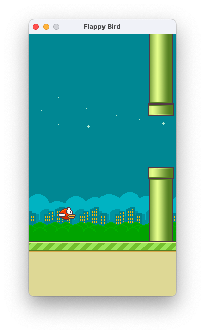

# Flappy Bird

## Задачи

- определение положения препятствий
- определение положения игрока
- поиск политики действия
- изменить схему наград и наказаний

## Определение положений

- OpenCV
- CV ML Models

## Вариарнты политик

- CE Method
- Q-Learning
- Policy \ Value iterations
- SARSA

## Схема наград

- Убрать наказание за столкновение
- Награду за каждую последующую колонну увеличивать
